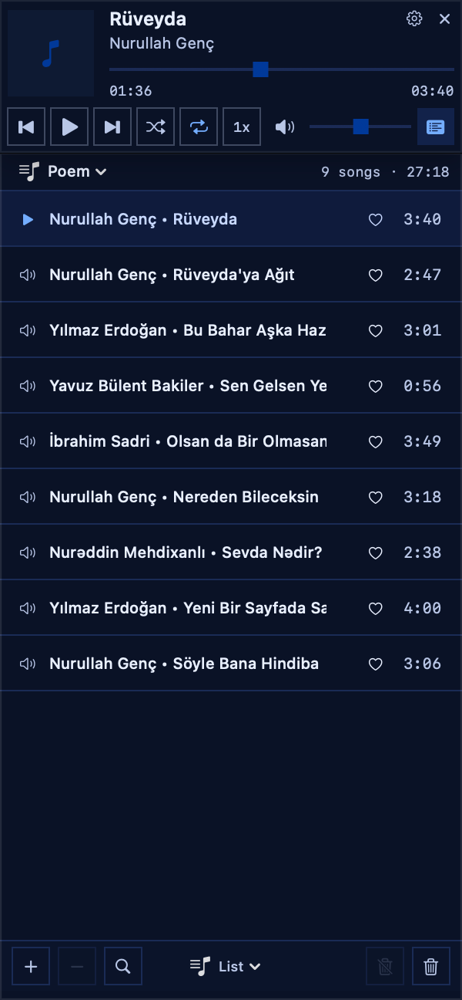

# Wored

A minimal music player for macOS built with SwiftUI.

## Features

- Minimal, compact player interface
- Docked playlist window (fixed width, resizable height)
- Album art display
- Metadata reading (title, artist, artwork)
- Drag and drop playlist reordering
- Finder drag and drop import for audio files and folders
- Track context menu actions
- Rich track information panel with file and audio details
- MP3/ID3 text and artwork tag editing
- Folder source rescan support
- Playlist search, status summary, and keyboard shortcuts
- Favorites and playback history views
- Auto-advance to next song
- Sharp, flat UI design (zero border radius)
- Settings panel with themes, EQ, and window controls

## Requirements

- macOS 13.0+
- Xcode 15.0+

## Installation

1. Clone the repository
2. Open `wored.xcodeproj` in Xcode
3. Build and run (Cmd + R)

## Usage

- Click the playlist icon to toggle playlist window
- Press Cmd+L to toggle the playlist window
- Press Cmd+O to add audio files or folders
- Press Cmd+, to open settings
- Press Space to toggle play/pause
- Double-click a song to play
- Press Cmd+F in the playlist window to search
- Use the playlist window tabs to switch between list, favorites, and history views
- Drag songs to reorder playlist
- Use playback controls to navigate

## Version

0.6.0
